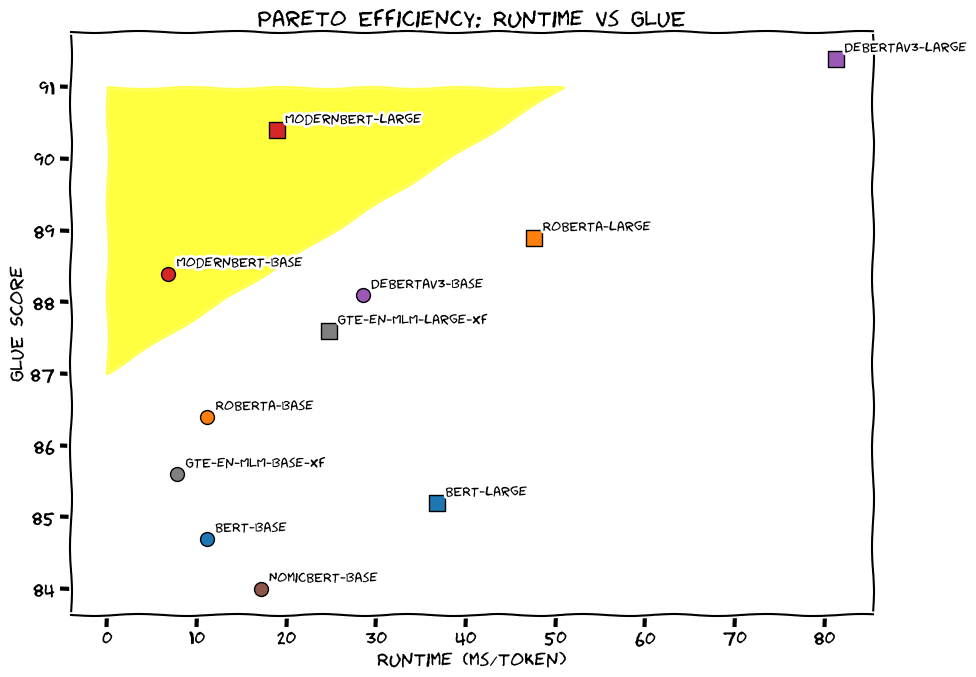

## **Project 1**

### **Project1: 医学语言理解**

在 [MedBench](https://medbench.opencompass.org.cn/docs) 中任选一个医学语言理解的数据集，

（选项一）在 Huggingface 上选择一个 BERT 系列的模型，在该数据集上进行微调，并给出性能评估，并与 Benchmark 中已有的其它 BERT 模型进行比较。

（选项二）在本地部署一个 LLM，进行该任务的测试，并与 Benchmark 中已有的 BERT 系列模型进行性能比较。

---
### 数据集选择
数据集介绍：
https://tianchi.aliyun.com/dataset/95414

### 模型选择

#### ModernBERT-large 
https://huggingface.co/answerdotai/ModernBERT-large 
#### deberta-v3-large 
https://huggingface.co/microsoft/deberta-v3-large 

### 参考
Finally, a Replacement for BERT（ 2024 年 12 月 19 日）
https://huggingface.co/blog/modernbert

